

# brandonhippe's Advent of Code Solutions for 2024
<!-- #{(year_tiles)} -->
<h1 align="center">
  2024 - 50 ⭐ - Python/Rust
</h1>
<a href="python/1.py">
  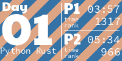
</a>
<a href="python/2.py">
  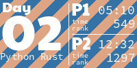
</a>
<a href="python/3.py">
  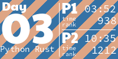
</a>
<a href="python/4.py">
  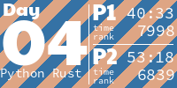
</a>
<a href="python/5.py">
  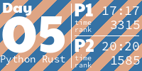
</a>
<a href="python/6.py">
  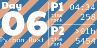
</a>
<a href="python/7.py">
  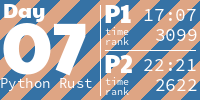
</a>
<a href="python/8.py">
  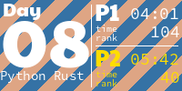
</a>
<a href="python/9.py">
  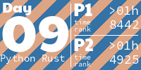
</a>
<a href="python/10.py">
  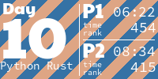
</a>
<a href="python/11.py">
  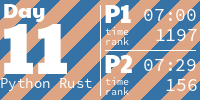
</a>
<a href="python/12.py">
  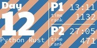
</a>
<a href="python/13.py">
  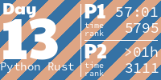
</a>
<a href="python/14.py">
  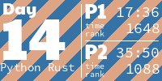
</a>
<a href="python/15.py">
  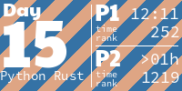
</a>
<a href="python/16.py">
  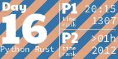
</a>
<a href="python/17.py">
  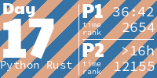
</a>
<a href="python/18.py">
  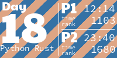
</a>
<a href="python/19.py">
  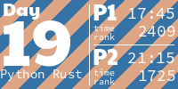
</a>
<a href="python/20.py">
  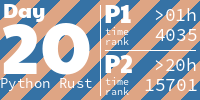
</a>
<a href="python/21.py">
  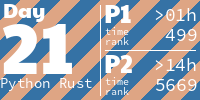
</a>
<a href="python/22.py">
  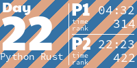
</a>
<a href="python/23.py">
  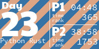
</a>
<a href="python/24.py">
  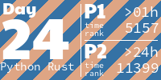
</a>
<a href="python/25.py">
  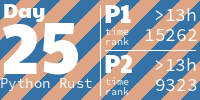
</a>
<!-- #{/(year_tiles)} -->

## Solution Languages:
 - [Python](python/README.md)
 - [Rust](rust/README.md)